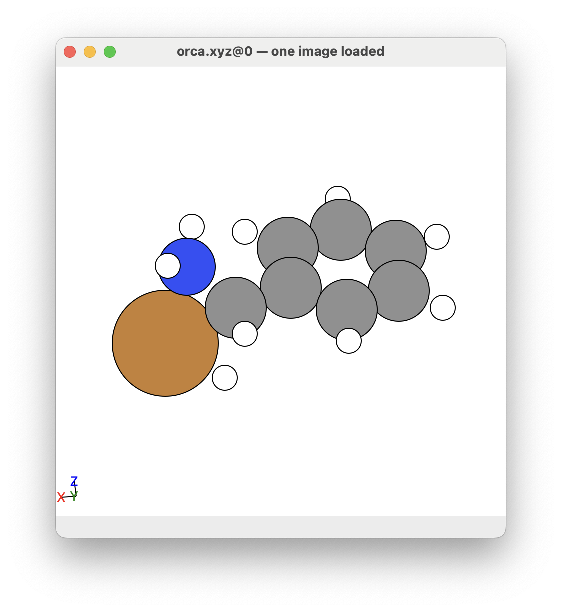
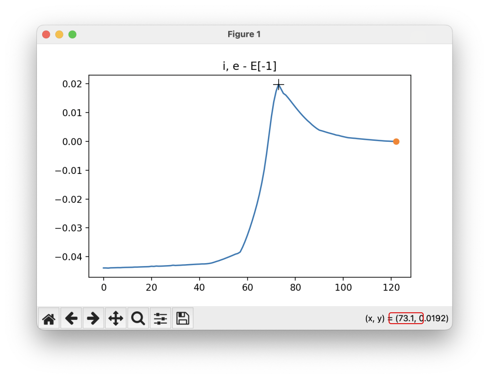

# Steps for Investigating Mechanistic Steps using ORCA

This page describes the procedure for investigating mechanistic steps for mechanisms in chemistry using ORCA.

**Goal: To find the transition state of a mechanistic step.**


## General Steps

The general steps that we will follow in this procedure are:

1. Locally optimise the reactants and products to their ground state.
2. Obtain the transition state by using either the SCAN or NEB method.
3. Optimise the transition state.
4. Validate the transition state using the IRC method. 
5. Perform some final checks
6. Obtain the energies and structures of your reactants, products, and transition state for reporting. 

Repeat steps 2-4 until you find the transition state for your mechanism. Sometimes it requires a bit of playing around. 


## Questions and Feedback

I am very keen for feedback about how you find the information in this github page, both the process and the clarity of what I have written. If you have any questions about this process, feed free to write me a message. 

To do this, click on the ``Issues`` tag at the top of this Github page, click the ``New issue`` button, and write you question/give you feedback. 

Thanks!


## ORCA

I have written this procedure for: 

* ORCA 5.0.3
* ORCA 5.0.4

This method should be valid for future versions of ORCA, but just in case any problems occur it may be due to ORCA version issues. 


## Before beginning

### Pre-requisite Programs

You will want to install the following programs on your computer using the terminal

#### Atomic Simulation Environment 

We will use atomic simulation environemnt to help easily view and edit molecules in a low memory program (https://wiki.fysik.dtu.dk/ase/ase/gui/basics.html and https://wiki.fysik.dtu.dk/ase/ase/gui/gui.html).

Install on your computer or HPC cluster using the following command in Python (https://wiki.fysik.dtu.dk/ase/install.html):

```
pip3 install --user -upgrade numpy scipy matplotlib
pip3 install --user --upgrade ase
```

#### Sublime or Notepad++

It is a good idea to have a notepad program for reading and editing files easily on your computer. Here are two recommendations for notepads:

* Sublime: https://www.sublimetext.com
* Notepad++: https://notepad.plus

### Before You Begin

Included in this git project are three folders with useful information, files, and programs in them. These are given below:

#### The ``bin`` folder

The ``bin`` folder contains a bunch of programs that are designed to analysing this procedure for obtaining the transition state for a mechanistic step. 

To install these programs to your computer:

1. Open the terminal and ``cd`` into the path that you want to download the programs into.

```bash
cd /Users/USERNAME
```

2. Download ORCA_Mechanism_Procedure to your computer by typing the following commands into the terminal:

```bash
git clone https://github.com/geoffreyweal/ORCA_Mechanism_Procedure.git
```

3. Change the permissions of the newly downloded ORCA_Mechanism_Procedure folder to 777:

```bash
chmod -R 777 ORCA_Mechanism_Procedure
```

4. Add the following to your ``~bashrc`` by typing the following into the terminal:

```bash
echo '#############################################
# For the ORCA Mechanism Procedure
export PATH_TO_ORCA_Mechanism_Procedure='$PWD'/ORCA_Mechanism_Procedure
export PATH="$PATH_TO_ORCA_Mechanism_Procedure"/bin:$PATH
#############################################' >> ~/.bashrc
```

This should add the following to your ``~/.bashrc`` file:

```bash
#############################################
# For the ORCA Mechanism Procedure
export PATH_TO_ORCA_Mechanism_Procedure="YOUR_PWD_PATH/ORCA_Mechanism_Procedure"
export PATH="$PATH_TO_ORCA_Mechanism_Procedure"/bin:$PATH
#############################################
```

An example of what the ``PATH_TO_ORCA_Mechanism_Procedure`` path should look like is shown below:

```bash
# An example of:
export PATH_TO_ORCA_Mechanism_Procedure="YOUR_PWD_PATH/ORCA_Mechanism_Procedure"
# is shown below
export PATH_TO_ORCA_Mechanism_Procedure=/Users/USERNAME/ORCA_Mechanism_Procedure
```

5. Source the ``~bashrc`` file:

```bash
source ~/.bashrc
```

6. Check that your computer recognises the programs by typing the following into the terminal

```bash
which viewOPT
```

If this has worked, the terminal should give you the path to the ``viewOPT`` program. For example

```bash
/Users/USERNAME/ORCA_Mechanism_Procedure/bin/viewOPT
```

If you get the message below, check that the path you gave for ``PATH_TO_ORCA_Mechanism_Procedure`` is pointing to the correct folder path. 

```bash
/usr/bin/which: no viewOPT in ...
```

#### The ``Templates`` folder

This folder contains all the templates for running this procedure. You should download these and customise them for your needs.

Make sure that you change the ORCA settings in the ``.inp`` files for your specifications, such as the functional, basis set, solvent model, etc. 

#### The ``Examples`` folder

This folder contains completed ORCA jobs for each step in this procedure. The purpose for this folder is to give you an example of what you should see when running ORCA. 

These files will be referenced in this repository as examples of what you expect to see as you work this procedure.

# The Machanistic Investigation Procedure

We will now perform the machanistic investigation procedure in ORCA. We will 

* Present the example that we will use to describe the steps to this procedure
* Indicate what settings you would include in all your ``inp`` files for this procedure
* Present the steps for performing the machanistic investigation procedure

## Mechanistic Step Example

The mechaistic step we will be used to help describe the process is shown below:

<p align="center">
    
</p>

Here, we want to determine the transition state for a Cu inserting itself into the C-H bond of the alpha bond in benzylamine. 

## Background

We are wanting to find the transition state for a single mechanistic step. Visually, we are trying to find a 1st order saddlepoint to get from the reactant to the product on the potential energy surface (See image below). In this article, we will look at how to obtain the transition state using ORCA.


* Note, the x and y axis given as R<sub>1</sub> and R<sub>2</sub> in the image above just indicate there is a change in spatial coordinates of the atoms in your molecule going from the reactant to the product. 
* (Image adapted from J. A. Keith, V. Vassilev-Galindo, B. Cheng, S. Chmiela, M. Gastegger, K.-R. Müller, and A. Tkatchenko; Chem. Rev. 2021, 121, 16, 9816–9872: https://doi.org/10.1021/acs.chemrev.1c00107)


## Pre-calculation step:

Before beginning, you need to decide what universal setting you want to use for your mecahnisms. This includes the basis set, functional, solvent model, etc. For example: 

```
!B3LYP DEF2-TZVP D3BJ
%CPCM EPSILON 6.02 REFRAC 1.3723 END
```

Other options that are good to include in all your orca input files are:

```
%SCF
    MaxIter 2000       # Here setting MaxIter to a very high number. Intended for systems that require sometimes 1000 iterations before converging (very rare).
    DIISMaxEq 5        # Default value is 5. A value of 15-40 necessary for difficult systems.
    directresetfreq 15 # Default value is 15. A value of 1 (very expensive) is sometimes required. A value between 1 and 15 may be more cost-effective.
END
%PAL NPROCS 32 END # The number of CPUs you want ORCA to use
%maxcore 2000 # This indicates you want ORCA to use only 2GB per core maximum, so ORCA will use only 2GB*32=64GB of memory in total.
```

**RECOMMENDATIONS**: With regards to the functional, basis set, solvent model, etc., it is recommended that you discuss what you are wanting to do with a computational chemist (if you are not a computational chemist) to get advice about how to set up these, as well as how to proceed with your project. This is important because you want to keep these as consistent as possible across all your mechanistic steps you perform. I would personally recommend reading other computation papers related to the system you are looking at understanding, as well as reading the following papers to understand what functional and basis set is most appropriate for your project:
* https://onlinelibrary.wiley.com/doi/epdf/10.1002/anie.202205735 (This paper is VERY recommended to non-computational chemists and computational chemist. It is a very good guide at all the considerations you should make and best Practices)
* https://pubs.rsc.org/en/content/articlelanding/2017/cp/c7cp04913g (The results section (particularly the end of the results section) provides a list of good functionals to use based on scientific validations)
* https://bpb-ap-se2.wpmucdn.com/blogs.unimelb.edu.au/dist/0/196/files/2021/05/GOERIGK_GroundStateDFT_RACI2021_handout.pdf (Slides from Larz Goerik based on the paper above)
* https://www.publish.csiro.au/CH/CH20093 (This paper give an idea of what you need to think about for excited state calculations)


## Step 1: Locally optimize reactant and product

First we need to locally optimize the reactants and products. To do this, make a ``Reactant`` folder and a ``Product`` folder, and add to each folder the ``.inp`` file for performing local optimisations. Make sure you include the following into your ``.inp`` files for both the reactant and product:

```
!OPT FREQ TightOpt TightSCF defgrid2
```

Here, we perform a geometry optimization to optimize the system. The tags here indicate you want to do the following: 

* ``OPT``: Indicates you want ORCA to perform a local optimisation. 
* ``FREQ``: Indicates you want ORCA to calculation the vibrational frequency for your molecule. This is used to verify that your optimised structure is indeed a local minimum. This will also give you the Gibbs free energy for your molecule that you (may) want to report as your energy. 
* ``TightOpt``: Tells ORCA to tighten the convergence criteria for each geometric step. See ORCA 5.0.4 Manual, page 20 for more info.
* ``TightSCF``: Tells ORCA to tighten the convergence criteria for each electronic step. 
* ``defgrid2``: Indicates how fine we want the intergration grid to be (This is the default)

**NOTE 1**: I have set the electronic optimisation steps to be tight (``TightSCF``). This is just to make sure the electronic are well converged, but it may be overdo. If you have problems, you can try using the normal convergence criteria for the electronic steps (``NormalSCF``)

**NOTE 2**: [Click here](https://sites.google.com/site/orcainputlibrary/numerical-precision?authuser=0) for more information about other electronic convergence and interaction grid settings.

An example of the complete ``orca.inp`` file for a local optimisation ORCA job is as follows (from ``Examples/Step1_Geo_Opt/Products/orca.inp``): 

```orca.inp
!B3LYP DEF2-TZVP D3BJ 
!OPT FREQ TIGHTOPT TightSCF defgrid2
%SCF
    MaxIter 2000       # Here setting MaxIter to a very high number. Intended for systems that require sometimes 1000 iterations before converging (very rare).
    DIISMaxEq 5        # Default value is 5. A value of 15-40 necessary for difficult systems.
    directresetfreq 15 # Default value is 15. A value of 1 (very expensive) is sometimes required. A value between 1 and 15 may be more cost-effective.
END
%CPCM EPSILON 6.02 REFRAC 1.3723 END
%PAL NPROCS 32 END
%maxcore 2000 # This indicates you want ORCA to use only 2GB per core maximum, so ORCA will use only 2GB*32=64GB of memory in total.
* xyzfile 1 1 product.xyz 

```

**NOTE**: Make sure you include a newline or two at the end of your ``orca.inp`` file, otherwise ORCA will get confused and not run.

Here, ``xyzfile`` allows you to import an xyz file into ORCA. You can add the xyz data directly in the ``.inp`` file, but I find having a separate ``xyz`` file is better because this allow you to look at the xyz file in a gui like in atomic simulation environment (ASE --> https://wiki.fysik.dtu.dk/ase/ase/gui/basics.html and https://wiki.fysik.dtu.dk/ase/ase/gui/gui.html). Include the ``xyz`` files of your reactant and product molecules in the ``Reactant`` and ``Product`` folders, respectively. If your reactants or product contain more than one molecule/chemical system, split them up and localise them individually in their own individual folders. 

Submit the job to slurm using the ``submit.sl`` file:

```bash
#!/bin/bash -e
#SBATCH --job-name=A3_Step1_Products
#SBATCH --ntasks=32
#SBATCH --mem=72GB
#SBATCH --partition=large
#SBATCH --time=3-00:00     # Walltime
#SBATCH --output=slurm-%j.out      # %x and %j are replaced by job name and ID
#SBATCH --error=slurm-%j.err
#SBATCH --nodes=1 # OpenMPI can have problems with ORCA over multiple nodes sometimes, depending on your system.

# Load ORCA
module load GCC/9.2.0
module load ORCA/5.0.3-OpenMPI-4.1.1

# ORCA under MPI requires that it be called via its full absolute path
orca_exe=$(which orca)

# Don't use "srun" as ORCA does that itself when launching its MPI process.
${orca_exe} orca.inp > output.out

```

**NOTE**: While ORCA has been told to use 2000 (MB) * 32 = 64 GB in the ``.inp`` file, we have told slurm to reserve ``72GB`` of memory. It is a good idea to give your ORCA job a few GBs of RAM extra in slurm just in case ORCA accidentally goes over it's allocated RAM. Here, I have abitrarily given this job 12GB more RAM just in case. 

### Outputs from ORCA

When ORCA is running, it will output several files, including an ``output.out`` file, an ``orca.xyz`` file, and an ``orca_trj.xyz`` file.

* ``output.out``: This file contains the details about how ORCA ran. This includes the vibrational frequency data to check if the locally optimised structure is in fact a local minimum.
* ``orca.xyz``: This is the locally optimised molecule. 
* ``orca_trj.xyz``: This file shows how ORCA locally optimised the molecule. Type ``viewOPT`` into the terminal to view how the molecule was optimised, including an energy profile. 

Once ORCA has finished, you should do the following checks:

#### Check 1: Look at your molecule and the energy profile and make sure it looks ok

The first thing to do is to look at your molecule and check if it looks sensible with your chemical intuition. You can do this by opening up the ``orca.xyz`` in your favourite GUI. I like to use atomic simulation environment (ASE). To look at the molecule and its energy profile:

1. Open a new terminal
2. ``cd`` into the optimisation folder
3. Type ``viewOPT`` into the terminal

```bash
# cd into your optimisation folder
cd ORCA_Mechanism_Procedure/Examples/Step1_Geo_Opt/Products

# View the optimisation 
viewOPT
# or directly view the orca_trj file.
ase gui orca_trj.xyz
# or save the OPT_images.xyz file only and copy it back to your computer
# to view with ``ase gui OPT_images.xyz`` (if you are using a HPC).
viewOPT False
```

**NOTE 1**: If ``viewOPT`` does not work, type ``ase gui orca_trj.xyz`` into the terminal instead of ``viewOPT``. 

**NOTE 2**: ``viewOPT`` will also create a xyz file called ``OPT_images.xyz`` that you can copy to your computer if you are using a high-capacity computer (HPC) system and view on your own computer. 
* If you just want to create the ``OPT_images.xyz`` file, type into the terminal ``viewOPT False`` (which will create the ``OPT_images.xyz`` file). 

Here, you want to **check that the molecule looks ok from your chemical and physical intuition**. Here is an example of what the optimised molecule looks like (the ``orca.xyz`` file here). If we look at the initial molecule geometry (by typing ``ase gui product.xyz`` into the terminal), we can see how the molecule has changed after being geometrically optimised: 


``viewOPT`` will also show you the energy profile for this optimisation. 


#### Check 2: Did the geometry optimisation converge successfully

You want to look for a table in the ``output.out`` file for a table with the title ``Geometry convergence``. There will be many of these tables, as one is given for each geometric step performed. You want to look at the last ``Geometry convergence`` table as this will give the detailed for the lastest geometrically optimised step. An example for the ``Products`` is given below:

```
                                .--------------------.
          ----------------------|Geometry convergence|-------------------------
          Item                value                   Tolerance       Converged
          ---------------------------------------------------------------------
          Energy change      -0.0000006152            0.0000010000      YES
          RMS gradient        0.0000177282            0.0000300000      YES
          MAX gradient        0.0000821491            0.0001000000      YES
          RMS step            0.0004097121            0.0006000000      YES
          MAX step            0.0015679250            0.0010000000      NO
          ........................................................
          Max(Bonds)      0.0003      Max(Angles)    0.05
          Max(Dihed)        0.09      Max(Improp)    0.00
          ---------------------------------------------------------------------

       The energies and gradients are converged
       and the convergence on bond distances, angles, dihedrals and impropers
       is acceptable.
       Convergence will therefore be signaled now


                    ***********************HURRAY********************
                    ***        THE OPTIMIZATION HAS CONVERGED     ***
                    *************************************************
```

In this example, you can see that the majority of the items of interest have converged, and ORCA has happy that the convergence criteria have been met. ORCA also tells you this by giving you a ``HURRAY`` message as well as a ``THE OPTIMIZATION HAS CONVERGED`` message (as you can see in above). 

#### Check 3: Does the molecule have any non-negative vibrational frequencies

After performing a local optimization, it is important that you look at the vibrational frequencies that are calculated. These are the frequencies that you could see in an IR or Raman spectra. You want to look through your ``.out`` file for a heading called ``VIBRATIONAL FREQUENCIES``. **We want to make sure that all the frequencies are non-negative**. This means we are in a local energy well. If one or more frequency is negative, this means we are not in a local minimum. In this case, you need to tighten the optimization, or need to look at your molecule and see if any part of it structurally does not make sense with your chemical intuition. 

In the example below (for ``Products``), you can see that there are no non-negative frequencies from the ``FREQ`` calculation, therefore we are in a local energy well: 

```
-----------------------
VIBRATIONAL FREQUENCIES
-----------------------

Scaling factor for frequencies =  1.000000000  (already applied!)

   0:         0.00 cm**-1
   1:         0.00 cm**-1
   2:         0.00 cm**-1
   3:         0.00 cm**-1
   4:         0.00 cm**-1
   5:         0.00 cm**-1
   6:        52.20 cm**-1
   7:        71.30 cm**-1
   8:       146.78 cm**-1
   9:       226.53 cm**-1
  10:       282.60 cm**-1
  11:       302.99 cm**-1
  12:       392.29 cm**-1
  13:       402.58 cm**-1
  14:       414.78 cm**-1
  15:       473.15 cm**-1
  16:       495.75 cm**-1
  17:       585.93 cm**-1
  18:       628.71 cm**-1
  19:       678.81 cm**-1
  20:       709.76 cm**-1
  21:       778.78 cm**-1
  22:       797.94 cm**-1
  23:       810.91 cm**-1
  24:       844.28 cm**-1
  25:       953.22 cm**-1
  26:       978.70 cm**-1
  27:       996.50 cm**-1
  28:      1019.06 cm**-1
  29:      1030.63 cm**-1
  30:      1046.65 cm**-1
  31:      1102.99 cm**-1
  32:      1137.60 cm**-1
  33:      1187.17 cm**-1
  34:      1210.13 cm**-1
  35:      1237.46 cm**-1
  36:      1309.92 cm**-1
  37:      1358.89 cm**-1
  38:      1377.61 cm**-1
  39:      1480.76 cm**-1
  40:      1514.47 cm**-1
  41:      1543.18 cm**-1
  42:      1608.95 cm**-1
  43:      1633.11 cm**-1
  44:      1647.22 cm**-1
  45:      1845.64 cm**-1
  46:      3184.30 cm**-1
  47:      3186.78 cm**-1
  48:      3189.57 cm**-1
  49:      3192.88 cm**-1
  50:      3203.72 cm**-1
  51:      3209.16 cm**-1
  52:      3487.08 cm**-1
  53:      3585.59 cm**-1
```


## Step 2: Perform SCAN or NEB calculation

We now want to figure out how the reaction could proceed and find the transition step. There are two methods for doing this, SCAN, and Nudged-Elastic-Band (NEB). You can perform either or both, and you often have to play about with these to find the transition step. 

## Step 2A: The SCAN method

In a SCAN calculation, we want to map how a reaction proceeds by change the distance between two atoms. Here, we perform a number of geometry optimisations where we fix the bond distance between two atoms, perform geometry optimization on all other atoms, then slightly change the distance between the atoms of interest, perform a geometry optimization on all other atoms again, slightly change the distance between the atoms of interest again, and so on and so on. 

To perform a SCAN, we first include this line in our input file:

```
!OPT NormalOPT TightSCF defgrid2 # Try TightOPT if you have convergence problems. 
```

The tags here indicate you want to do the following: 

* ``OPT``: Indicates you want ORCA to perform a local optimisation. 
* ``NormalOPT``: For these calculations we are only wanting to get a good idea of what the transition state looks like. So we dont need to both with using tight convergence settings. Normal convergence sets is perfect for SCAN as it is the usual convergence criteria for performing optimisations, as will run faster than using ``TightOPT``. However, if you have problems with convergence issues, you can try using ``TightOPT``. See ORCA 5.0.4 Manual, page 20 for more info.
* ``TightSCF``: Tells ORCA to tighten the convergence criteria for each electronic step. 
* ``defgrid2``: Indicates how fine we want the intergration grid to be (This is the default)

We also include the following lines:

```
%geom 
    SCAN B 11 14 = 3.242, 0.742, 126 END 
END
```

In this example, we have told ORCA to begin by setting the distance between atom 11 and 17 to 2.131 Å, and then increase the distance between these two atoms to 24.131 Å in increments of $\frac{24.131-2.131}{441-1} = 0.05$ Å. 

**NOTE 1**: You will want to measure the initial distance between your two atoms using a GUI like ASE GUI. This is the value you want to put in for the initial bond distance. This is how I got the bond distance between atom 11 and 17 to 2.131 Å for this example. 

**NOTE 2**: ORCA counts atoms starting from 0. This means that in some GUIs (like GView), atom 11 here is atom 12 in GView. **In the ASE GUI and all the programs given here, atoms numbers are equal to ORCA. I.e.: atom 11 in the ASE GUI means atom 11 in ORCA**. 

**NOTE 3**: We have set the number of steps to perform to 441 rather than 440. This is because we are including the endpoint in our SCAN, and I want the increments to be spaced by a rational value (i.e.: $\frac{24.131-2.131}{441-1} = 0.05$ Å step size). This is just a personal preference of mine, and is not a hard rule. 

In this example, we are looking at how a Cu atom could insert itself into a C-H bond. The ``orca.inp`` file for this example is given below (from ``Examples/Step2_Find_TS/SCAN/orca.inp``):

**NOTE 4**: By default I am use to using ``TightOPT`` for good convergence of the reactants, products, and transition states. However, the SCAN method is just a method for locating the transition state, not finalising a converged state. For this reason, I would recommend using the ``NormalOPT`` convergence settings, as this is fast and allows you to try more variations. If you have problems, try tightening the convergence using ``TightOPT``. 

```
!B3LYP DEF2-TZVP D3BJ
!OPT NormalOPT TightSCF defgrid2 # Try TightOPT if you have convergence problems. 
%SCF
    MaxIter 2000       # Here setting MaxIter to a very high number. Intended for systems that require sometimes 1000 iterations before converging (very rare).
    DIISMaxEq 5        # Default value is 5. A value of 15-40 necessary for difficult systems.
    directresetfreq 15 # Default value is 15. A value of 1 (very expensive) is sometimes required. A value between 1 and 15 may be more cost-effective.
END
%CPCM EPSILON 6.02 REFRAC 1.3723 END
%PAL NPROCS 32 END
%maxcore 2000
%geom 
    SCAN B 11 14 = 3.242, 0.742, 126 END 
END
* xyzfile 1 1 opt_product.xyz

```

### Outputs from ORCA

As well as the ``output.out`` and ``orca_trj.xyz`` files, ORCA will also get:

* A series of files called ``orca.001.xyz``, ``orca.002.xyz``, ``orca.003.xyz``, ... up to ``orca.126.xyz``. These are the steps in the SCAN process. 

**NOTE**: The ``orca_trj.xyz`` contains the xyz files for every geometric step across all ``orca.ABC.xyz`` file, so it is not as useful in it's own. However make sure you keep it, because it is used by the ``viewSCAN`` program.

To view the SCAN mechanism and the energy path, type ``viewSCAN`` in the terminal and hit enter. This will load a program that will allow you to see how the SCAN calculation performed your mechanism, along with the energy profile. 

```bash
# cd into your optimisation folder
cd ORCA_Mechanism_Procedure/Examples/Step2_Find_TS/SCAN

# View the SCAN calculation 
viewSCAN
# or save the SCAN_images.xyz file only and copy it back to your computer
# to view with ``ase gui SCAN_images.xyz`` (if you are using a HPC).
viewSCAN False
```

**NOTE 1**: ``viewSCAN`` will also create a xyz file called ``SCAN_images.xyz`` that you can copy to your computer if you are using a high-capacity computer (HPC) system and view on your own computer. 
* If you just want to create the ``SCAN_images.xyz`` file, type into the terminal ``viewSCAN False`` (which will create the ``SCAN_images.xyz`` file). 

You will get a GUI that shows you the following SCAN pathway:


The energy profile for this example is given below:


**NOTE 2**: The energy goes up at the end because the hydrogen atom is probably getting too close to the carbon atom. We can ignore this part of the SCAN, as it is not relavant to us for finding the transition state for this mechanistic step. 

The easiest way to use this GUI is to zoom in on the part of the energy profile looks like the transition state (by clicking on the  button), and from this determine the image this corresponds to by looking at the x axis. Move the cursor over the highest point along the energy profile, and read the x value:


This is what the given transition state looks like in this example:


This is a promising transition state, but we need to proceed with steps 3 and 4 to make sure it is ok. 

Once ORCA has finished and you have viewed your SCAN pathway and obtained your transition state, you should do the following check:

#### Check: Does the SCAN path make sense chemically and physically

You will want to look at the SCAN path and check if it chemically and physically makes sense. If it does not, you need to redo the SCAN and try something else, like making the two atoms contract closer to each other rather than stretch, or maybe try contracting or expanding the distance between other atoms.  

#### Advice about SCANs

In this example, I forced the SCAN to gradually decrease the distance between atom 11 (C) and atom 14 (H). However, this is not the only way I could have performed this SCAN. 
* For example, I could have started with the Cu atom bonded to the N atom, and gradually decrease the distance between atoms 11 (C) and 17 (Cu) to force them to form a bond.
* I decided to start with Cu inserted into the C-H bond and force the C and H to come together because I thought this was the best way to obtain the transition state for this mechanistic step.
* It is not uncommon that you need to try a few different SCAN paths to get the transition state you are looking for. 

#### Other Information about performing SCANs in ORCA

See https://sites.google.com/site/orcainputlibrary/geometry-optimizations/tutorial-saddlepoint-ts-optimization-via-relaxed-scan for more information. 


## Step 2B: Nudged Elastic Band (NEB)

In an NEB, we trace a path from the reactant to the product. An optimization is performed across all the images at the same time in order to try to find the transition step.

There are a few different ways you can proceed when doing an NEB calculation. For this reason, see the link below to learnabout how to do NEBs in ORCA:

https://github.com/geoffreyweal/ORCA_NEB_Procedure


## Step 3: Optimise the Transition State

While Your SCAN or NEB will have done a good job at finding the transition state, it is a good idea to perform a transition state geometry optimisation to make sure that your transition state lies on the saddlepoint as best as possible. 

To do this, we will optimise the transition state using the ``OptTS`` tag. 
* The ``OptTS`` method is designed to find the most optimal transition state by allowing the molecule to follow the eigenvector (vibrational mode) for the most negative eigenvalue (frequency).

To perform a ``OptTS`` calcualtion, we include the following line in the ``orca.inp``: 

```
!OptTS NumFreq TightOPT TightSCF defgrid2
```

The tags here indicate the following: 

* ``OptTS``: Indicates that we want to optimise the molecule towards the transition state
* ``NumFreq``: We want to calculate the numerical frequency after the optimisation process to make sure that our transition state only has one negative vibrational frequency (transition states are defined as the lowest energy point between two local minima that has only 1 negative vibrational frequency).

We also include the following in our ``inp`` file: 

```
%GEOM
    Calc_Hess true # Calculate Hessian in the beginning
    NumHess true   # Request numerical Hessian (analytical not available)
    Recalc_Hess 1  # Recalculate the Hessian for every step
END
```

The full ``orca.inp`` file for this example is given below (found in ``Examples/Step3_Opt_TS/orca.inp``): 

```orca.inp
!B3LYP DEF2-TZVP D3BJ
!OptTS NumFreq TIGHTOPT TightSCF defgrid2
%SCF
    MaxIter 2000       # Here setting MaxIter to a very high number. Intended for systems that require sometimes 1000 iterations before converging (very rare).
    DIISMaxEq 5        # Default value is 5. A value of 15-40 necessary for difficult systems.
    directresetfreq 15 # Default value is 15. A value of 1 (very expensive) is sometimes required. A value between 1 and 15 may be more cost-effective.
END
%CPCM EPSILON 6.02 REFRAC 1.3723 END
%PAL NPROCS 32 END
%maxcore 2000
%GEOM
    Calc_Hess true # Calculate Hessian in the beginning
    NumHess true # Request numerical Hessian (analytical not available)
    Recalc_Hess 1  # Recalculate the Hessian for every step
END
* xyzfile 1 1 orca.073.xyz

```

### Outputs from ORCA

ORCA will create a number of files. These are the imporant ones to looks at for optimising the transition state geometry: 

* ``output.out``: The output file, which will tell you if the transition state converged or not.
* ``orca.xyz``: This is the transition state found (if convergence was successful)
* ``orca_trj.xyz``: This is the trajectory file that indicates the steps for how the calculation proceeded. 

Once ORCA has finished, you want to do the following checks

#### Check 1: Look at your transition state structure and the energy profile and make sure it looks ok

Just like in step 1 for the reactants and products, you also want to look at your transition state and make sure it makes sense to you. This is a very important check, as it is very possible that ORCA goes off track when locating the transition state. This is a problem not just for ORCA, but for any computational chemistry software. 

You can check the transition state by opening up the ``orca.xyz`` file. You can do this in ASE by:

1. Opening a new terminal
2. ``cd`` into the optimisation folder
3. Type ``ase gui orca.xyz`` into the terminal

```bash
# cd into your trasnition state optimisation folder
cd ORCA_Mechanism_Procedure/Examples/Step3_Opt_TS

# View the trasnrtiion state 
ase gui orca.xyz
```

This is what I got for this example (see below). 
* When comparing this transition state to the reactants and products, I can see that the hydrogen atom attached to the Cu atom has moved closer to the C atom, so I am happy.



#### Check 2: Did the transition state converge successfully

Just like when we were checking convergence of the product and reactant in step 1, we want to find the geometry convergence table and check that we are happy that the transition state converged properly, and we have got the ``HURRAY THE OPTIMIZATION HAS CONVERGED`` message: 

```
                                .--------------------.
          ----------------------|Geometry convergence|-------------------------
          Item                value                   Tolerance       Converged
          ---------------------------------------------------------------------
          Energy change      -0.0000006729            0.0000010000      YES
          RMS gradient        0.0000019507            0.0000300000      YES
          MAX gradient        0.0000087391            0.0001000000      YES
          RMS step            0.0000876984            0.0006000000      YES
          MAX step            0.0003670792            0.0010000000      YES
          ........................................................
          Max(Bonds)      0.0000      Max(Angles)    0.00
          Max(Dihed)        0.02      Max(Improp)    0.00
          ---------------------------------------------------------------------

                    ***********************HURRAY********************
                    ***        THE OPTIMIZATION HAS CONVERGED     ***
                    *************************************************
```

#### Check 3: Check that we have only 1 negative vibrational frequency

We want to look at the frequency calculation and check that there is only 1 negative frequency. This tells us that we are on a saddlepoint on the potential energy landscape.
* Generally any negative frequency is good, but a negative frequency that is greater than $-100cm^{-1}$ is a good sign that the transition state is good. 
* This is because the value of the frequency indicates the curvative of the transition state across the saddlepoint. The bigger the number, the steeper the energy decent on each side of the saddlepoint.
* A negative frequency between $-20cm^{-1}$ and $-100cm^{-1}$ is fine, but just beware you may have problems with step 4. 
    * A transition state with this value of negative frequency is absolutely fine, it might just have problems with step 4 for technical reasons.

In the example below, you can see we only have one negative vibrational frequency, so our transition state is good to go!

```
-----------------------
VIBRATIONAL FREQUENCIES
-----------------------

Scaling factor for frequencies =  1.000000000 (already applied!)

   0:         0.00 cm**-1
   1:         0.00 cm**-1
   2:         0.00 cm**-1
   3:         0.00 cm**-1
   4:         0.00 cm**-1
   5:         0.00 cm**-1
   6:      -825.23 cm**-1 ***imaginary mode***
   7:        49.91 cm**-1
   8:        82.22 cm**-1
   9:       173.50 cm**-1
  10:       227.95 cm**-1
  11:       261.81 cm**-1
  12:       358.33 cm**-1
  13:       410.98 cm**-1
  14:       424.28 cm**-1
  15:       488.31 cm**-1
  16:       526.93 cm**-1
  17:       582.32 cm**-1
  18:       632.43 cm**-1
  19:       634.34 cm**-1
  20:       691.62 cm**-1
  21:       709.44 cm**-1
  22:       791.66 cm**-1
  23:       809.30 cm**-1
  24:       855.97 cm**-1
  25:       945.21 cm**-1
  26:       989.13 cm**-1
  27:      1016.46 cm**-1
  28:      1021.89 cm**-1
  29:      1049.78 cm**-1
  30:      1094.43 cm**-1
  31:      1105.44 cm**-1
  32:      1140.24 cm**-1
  33:      1182.51 cm**-1
  34:      1183.23 cm**-1
  35:      1208.66 cm**-1
  36:      1246.13 cm**-1
  37:      1336.77 cm**-1
  38:      1369.03 cm**-1
  39:      1435.39 cm**-1
  40:      1493.01 cm**-1
  41:      1533.74 cm**-1
  42:      1622.65 cm**-1
  43:      1623.55 cm**-1
  44:      1639.65 cm**-1
  45:      1778.18 cm**-1
  46:      3167.30 cm**-1
  47:      3174.81 cm**-1
  48:      3183.83 cm**-1
  49:      3192.85 cm**-1
  50:      3196.63 cm**-1
  51:      3201.45 cm**-1
  52:      3527.56 cm**-1
  53:      3628.36 cm**-1
```

####  Check 4 (Optional): Check how ORCA optimised your transition state

If you think there might be something funny happening, it is sometimes a good idea to check how ORCA optimised your transition state.

You can do this by changing directory into the transition state folder and typing ``viewOPT`` into the terminal. 

```bash
# change directory into the Step3_Opt_TS folder
cd ORCA_Mechanism_Procedure/Examples/Step3_Opt_TS

# View the geometry optimisation by ORCA in ASE using viewOPT
viewOPT
# or save the OPT_images.xyz file only and copy it back to your computer
# to view with ``ase gui OPT_images.xyz`` (if you are using a HPC).
viewOPT False
```

**NOTE 1**: ``viewOPT`` will also create a xyz file called ``OPT_images.xyz`` that you can copy to your computer if you are using a high-capacity computer (HPC) system and view on your own computer. 
* If you just want to create the ``OPT_images.xyz`` file, type into the terminal ``viewOPT False`` (which will create the ``OPT_images.xyz`` file). 

**NOTE 2**: Do not expect the energy to go down. The energy may go up during the geometry optimisation, as we are trying to find a saddlepoint on the potential energy surface rather than a local mininum. 

#### More Information about optimising transition states with ORCA

See https://sites.google.com/site/orcainputlibrary/geometry-optimizations/tutorial-saddlepoint-ts-optimization-via-relaxed-scan#h.pnxa1btinh0w for more information on how to optimise a molecule to a transition state.


## Step 4A: Validate the transition state using the intrinsic reaction coordinate (IRC) method

We now have a transition state, but we need to check that it is the correct transition state for our mechanistic step. To do this, we want to make sure that we can obtain our reactants and product if we perform a geometric optimisation on our transition state. However, because we have a saddlepoint we need a way so that we can obtain the reactants for one geometry optimisations, and the products for another geoemtry optimisation. Do achieve this, we perform the intrinsic reaction coordinate (IRC) method. This method will perform two geometry optimisations on the transition state, where it initially nudges the transition state in each direction of the saddlepoint and then performs two separate geometry optimisations on each side of the saddlepoint. 


* Note, the x and y axis given as R<sub>1</sub> and R<sub>2</sub> in the image above just indicate there is a change in spatial coordinates of the atoms in your molecule going from the reactant to the product. 
* (Image adapted from J. A. Keith, V. Vassilev-Galindo, B. Cheng, S. Chmiela, M. Gastegger, K.-R. Müller, and A. Tkatchenko; Chem. Rev. 2021, 121, 16, 9816–9872: https://doi.org/10.1021/acs.chemrev.1c00107)

To perform this we want to include the following in the ``orca.inp`` file:

```
!IRC TightSCF defgrid2
```

We also want to include the following options for the IRC method:

```
%IRC
    MaxIter 2000
    InitHess calc_numfreq
    Direction both
    TolMAXG 2.e-3  # Max gradient (a.u.). Currently set to values equivalent to LooseOpt.
    TolRMSG 5.e-4  # RMS gradient (a.u.). Currently set to values equivalent to LooseOpt.
    PrintLevel 1
end
```

**NOTE 1**: The ``TightOPT`` keyword (and other geometric convergence like ``NormalOPT`` and ``LooseOPT``) does not work with ``IRC``. Instead, we include the ``TolMAXG`` and ``TolRMSG`` keywords in the ``orca.inp`` file. 

**NOTE 2**: It is recommended to set ``TolMAXG`` and ``TolRMSG`` to values equivalent to the ``LooseOPT`` keyword. This is because IRC can take a very long time to run to you use tighter convergence criteria. We will check the outputs from the IRC method with the ``TightOPT`` keyword in Step 4B. 

**NOTE 3**: While we are using the default setting ``TolMAXG`` and ``TolRMSG`` (set to that of ``LooseOPT``.), you can change this. If you want to tighten the geometric convergence criteria for the IRC method, see the following below. However, for this procedure it is recommended to keep the ``LooseOPT`` settings for ``TolMAXG`` and ``TolRMSG``, and use tighter convergence settings in Step 4B. 

```
# TolMAXG and TolRMSG settings for:

LooseOpt
TolMAXG 2.e-3  # Max gradient (a.u.). Currently set to values equivalent to LooseOpt.
TolRMSG 5.e-4  # RMS gradient (a.u.). Currently set to values equivalent to LooseOpt.

NormalOpt
TolMAXG 3.e-4  # Max gradient (a.u.). Currently set to values equivalent to NormalOpt.
TolRMSG 1.e-4  # RMS gradient (a.u.). Currently set to values equivalent to NormalOpt.

TightOpt
TolMAXG 1.e-4  # Max gradient (a.u.). Currently set to values equivalent to TightOpt.
TolRMSG 3.e-5  # RMS gradient (a.u.). Currently set to values equivalent to TightOpt.

```

The full ``orca.inp`` in the ``Examples/Step4_Validation_TS`` folder is:

```
!B3LYP DEF2-TZVP D3BJ
!IRC TightSCF defgrid2
%SCF
    MaxIter 2000       # Here setting MaxIter to a very high number. Intended for systems that require sometimes 1000 iterations before converging (very rare).
    DIISMaxEq 5        # Default value is 5. A value of 15-40 necessary for difficult systems.
    directresetfreq 15 # Default value is 15. A value of 1 (very expensive) is sometimes required. A value between 1 and 15 may be more cost-effective.
END
%CPCM EPSILON 6.02 REFRAC 1.3723 END
%PAL NPROCS 32 END
%maxcore 2000
%IRC
    MaxIter 2000
    InitHess calc_numfreq
    Direction both
    TolMAXG 1.e-4  # Max gradient (a.u.). Currently set to values equivalent to TightOpt.
    TolRMSG 3.e-5  # RMS gradient (a.u.). Currently set to values equivalent to TightOpt.
    PrintLevel 1
end
* xyzfile 1 1 TS.xyz

```

### Outputs from ORCA

ORCA will create a number of files. These are the imporant ones to looks at for the IRC method:

* ``output.out``: We will want to look at this file to make sure the IRC method has not run into any problems. 
* ``orca_IRC_F_trj.xyz``: This is the geometric optimisation steps performed for the forward step
* ``orca_IRC_B_trj.xyz``: This is the geometric optimisation steps performed for the backwards step
* ``orca_IRC_Full_trj.xyz``: This is the geometric optimisation steps performed for the full IRC method. This include the steps from the ``orca_IRC_B_trj.xyz`` and ``orca_IRC_F_trj.xyz`` files. 

**NOTE**: You will find that the output from the ``Forward`` step maybe either the reactant or the product. So don't worry if the ``Forward`` step gives you your reactant. This only means that in that case your ``Backward`` step should be your product. 

Once ORCA has finished, you want to do the following checks:

#### Check 1: Make sure the ``output.out`` file indicates the calculation finished successfully

Look at the end of the ``output.out`` file and makes sure there is some sort of message that says that ORCA finished successfully, like that below

```
****ORCA TERMINATED NORMALLY****
```

Also, make sure you see the following messages for the forward and reverse components of the calculation

```
***********************HURRAY********************
***            THE IRC HAS CONVERGED          ***
*************************************************
```

See an example of this below:

```
         *************************************************************
         *                          FORWARD IRC                      *
         *************************************************************

Iteration    E(Eh)      dE(kcal/mol)  max(|G|)   RMS(G) 
Convergence thresholds                0.002000  0.000500            
    0     -1967.123543   -0.979797    0.009308  0.001940
    1     -1967.125107   -1.961029    0.010517  0.002247
    2     -1967.125685   -2.324148    0.009427  0.002005
    3     -1967.126638   -2.922291    0.008829  0.001902
    4     -1967.127685   -3.579032    0.008935  0.001925
    5     -1967.128743   -4.242983    0.008811  0.001918
    6     -1967.129792   -4.901037    0.008480  0.001886
    7     -1967.130808   -5.538586    0.008103  0.001825
    8     -1967.131785   -6.151559    0.007581  0.001749
    9     -1967.132714   -6.734522    0.007043  0.001660
   10     -1967.133593   -7.286174    0.006451  0.001567
   11     -1967.134421   -7.805729    0.005867  0.001475
   12     -1967.135196   -8.292411    0.005297  0.001379
   13     -1967.135923   -8.748126    0.005132  0.001291
   14     -1967.136596   -9.170984    0.004920  0.001196
   15     -1967.137223   -9.564303    0.004676  0.001112
   16     -1967.137799   -9.925919    0.004390  0.001024
   17     -1967.138332   -10.259902    0.004096  0.000946
   18     -1967.138819   -10.565546    0.003785  0.000899
   19     -1967.139249   -10.835330    0.003514  0.000948
   20     -1967.139400   -10.929956    0.003402  0.000992
   21     -1967.139472   -10.975463    0.003359  0.000805
   22     -1967.139573   -11.038703    0.003294  0.000752
   23     -1967.139676   -11.103301    0.003226  0.000737
   24     -1967.139777   -11.166565    0.003160  0.000725
   25     -1967.139875   -11.228295    0.003094  0.000709
   26     -1967.139972   -11.288928    0.003030  0.000696
   27     -1967.140066   -11.348413    0.002966  0.000683
   28     -1967.140159   -11.406639    0.002904  0.000668
   29     -1967.140250   -11.463913    0.002843  0.000659
   30     -1967.140339   -11.519754    0.002784  0.000642
   31     -1967.140427   -11.574934    0.002725  0.000632
   32     -1967.140513   -11.628772    0.002668  0.000617
   33     -1967.140598   -11.681774    0.002611  0.000610
   34     -1967.140680   -11.733339    0.002555  0.000593
   35     -1967.140761   -11.784354    0.002500  0.000584
   36     -1967.140840   -11.834091    0.002445  0.000571
   37     -1967.140918   -11.883058    0.002391  0.000562
   38     -1967.140994   -11.930757    0.002338  0.000548
   39     -1967.141069   -11.977763    0.002283  0.000540
   40     -1967.141142   -12.023625    0.002231  0.000526
   41     -1967.141214   -12.068727    0.002177  0.000517
   42     -1967.141284   -12.112766    0.002126  0.000505
   43     -1967.141353   -12.155984    0.002072  0.000495
   44     -1967.141421   -12.198270    0.002021  0.000484
   45     -1967.141487   -12.239663    0.001968  0.000474

                      ***********************HURRAY********************
                      ***            THE IRC HAS CONVERGED          ***
                      *************************************************


         *************************************************************
         *                          BACKWARD IRC                     *
         *************************************************************

Iteration    E(Eh)      dE(kcal/mol)  max(|G|)   RMS(G) 
Convergence thresholds                0.002000  0.000500            
    0     -1967.124311   -1.461728    0.013600  0.003053
    1     -1967.128051   -3.808494    0.019714  0.004397
    2     -1967.133340   -7.127757    0.025829  0.005526
    3     -1967.139701   -11.118892    0.028311  0.006052
    4     -1967.146117   -15.145537    0.025173  0.005719
    5     -1967.151801   -18.711772    0.021770  0.004970
    6     -1967.156328   -21.552647    0.019496  0.003996
    7     -1967.160222   -23.995928    0.017140  0.003405
    8     -1967.163541   -26.079063    0.014761  0.002952
    9     -1967.166543   -27.962685    0.012861  0.002663
   10     -1967.169310   -29.699090    0.011409  0.002469
   11     -1967.171890   -31.318299    0.010454  0.002305
   12     -1967.174306   -32.834058    0.009581  0.002151
   13     -1967.176514   -34.219361    0.008704  0.001979
   14     -1967.178474   -35.449270    0.007565  0.001857
   15     -1967.180070   -36.450828    0.006486  0.002120
   16     -1967.180383   -36.647601    0.006324  0.001676
   17     -1967.181098   -37.096403    0.006063  0.001440
   18     -1967.181826   -37.552813    0.005805  0.001339
   19     -1967.182504   -37.978531    0.005485  0.001245
   20     -1967.183123   -38.366555    0.005144  0.001163
   21     -1967.183672   -38.711135    0.004725  0.001095
   22     -1967.184138   -39.003554    0.004304  0.001179
   23     -1967.184249   -39.073229    0.004180  0.000973
   24     -1967.184460   -39.205562    0.003928  0.000823
   25     -1967.184673   -39.339210    0.003658  0.000768
   26     -1967.184868   -39.461483    0.003377  0.000705
   27     -1967.185048   -39.574485    0.003127  0.000649
   28     -1967.185213   -39.678191    0.002876  0.000597
   29     -1967.185364   -39.773179    0.002658  0.000556
   30     -1967.185501   -39.858798    0.002432  0.000539
   31     -1967.185617   -39.931798    0.002267  0.000595
   32     -1967.185652   -39.953849    0.002204  0.000520
   33     -1967.185706   -39.987374    0.002116  0.000434
   34     -1967.185763   -40.023646    0.002029  0.000418
   35     -1967.185819   -40.058388    0.001937  0.000401

                      ***********************HURRAY********************
                      ***            THE IRC HAS CONVERGED          ***
                      *************************************************
```

#### Check 2: Make sure that the energies of each geometric optimisation step is less than the transition step from the ``output.out`` file

We want to make sure that the energy of our trasnition state is in fact lower than all points along the energy profile. This is because:
* The IRC method works by initially pushing the molecule down the saddle of the potential energy surface towards the reactant and product minima, so the energy should have decreased from transition state in the forward and backwards directions. 

To do this, you want to look at the ``IRC PATH SUMMARY`` in your output file and make sure your transition state (``TS``) is the highest energy step in the IRC path. 

The trasition state should be the number of the final ``Convergence Iteration`` from the backwards step, plus 2. In this example, our ``BACKWARD IRC`` process required 35 geometry optimisation steps, so we expect our transition state to be at step 37 in the ``IRC PATH SUMMARY`` table. 

Below show ax example of this from ``Examples/Step4A_Validate_TS/output.log``. You can see that the transition step occurs at step 37, as expected. We also see that the energy of the transition state is the largest for all steps. 

```
---------------------------------------------------------------
                       IRC PATH SUMMARY              
---------------------------------------------------------------
All gradients are in Eh/Bohr.

Step        E(Eh)      dE(kcal/mol)  max(|G|)   RMS(G) 
   1     -1967.185819   -40.058388    0.001937  0.000401
   2     -1967.185763   -40.023646    0.002029  0.000418
   3     -1967.185706   -39.987374    0.002116  0.000434
   4     -1967.185652   -39.953849    0.002204  0.000520
   5     -1967.185617   -39.931798    0.002267  0.000595
   6     -1967.185501   -39.858798    0.002432  0.000539
   7     -1967.185364   -39.773179    0.002658  0.000556
   8     -1967.185213   -39.678191    0.002876  0.000597
   9     -1967.185048   -39.574485    0.003127  0.000649
  10     -1967.184868   -39.461483    0.003377  0.000705
  11     -1967.184673   -39.339210    0.003658  0.000768
  12     -1967.184460   -39.205562    0.003928  0.000823
  13     -1967.184249   -39.073229    0.004180  0.000973
  14     -1967.184138   -39.003554    0.004304  0.001179
  15     -1967.183672   -38.711135    0.004725  0.001095
  16     -1967.183123   -38.366555    0.005144  0.001163
  17     -1967.182504   -37.978531    0.005485  0.001245
  18     -1967.181826   -37.552813    0.005805  0.001339
  19     -1967.181098   -37.096403    0.006063  0.001440
  20     -1967.180383   -36.647601    0.006324  0.001676
  21     -1967.180070   -36.450828    0.006486  0.002120
  22     -1967.178474   -35.449270    0.007565  0.001857
  23     -1967.176514   -34.219361    0.008704  0.001979
  24     -1967.174306   -32.834058    0.009581  0.002151
  25     -1967.171890   -31.318299    0.010454  0.002305
  26     -1967.169310   -29.699090    0.011409  0.002469
  27     -1967.166543   -27.962685    0.012861  0.002663
  28     -1967.163541   -26.079063    0.014761  0.002952
  29     -1967.160222   -23.995928    0.017140  0.003405
  30     -1967.156328   -21.552647    0.019496  0.003996
  31     -1967.151801   -18.711772    0.021770  0.004970
  32     -1967.146117   -15.145537    0.025173  0.005719
  33     -1967.139701   -11.118892    0.028311  0.006052
  34     -1967.133340   -7.127757    0.025829  0.005526
  35     -1967.128051   -3.808494    0.019714  0.004397
  36     -1967.124311   -1.461728    0.013600  0.003053
  37     -1967.121981    0.000000    0.000025  0.000010 <= TS
  38     -1967.123543   -0.979797    0.009308  0.001940
  39     -1967.125107   -1.961029    0.010517  0.002247
  40     -1967.125685   -2.324148    0.009427  0.002005
  41     -1967.126638   -2.922291    0.008829  0.001902
  42     -1967.127685   -3.579032    0.008935  0.001925
  43     -1967.128743   -4.242983    0.008811  0.001918
  44     -1967.129792   -4.901037    0.008480  0.001886
  45     -1967.130808   -5.538586    0.008103  0.001825
  46     -1967.131785   -6.151559    0.007581  0.001749
  47     -1967.132714   -6.734522    0.007043  0.001660
  48     -1967.133593   -7.286174    0.006451  0.001567
  49     -1967.134421   -7.805729    0.005867  0.001475
  50     -1967.135196   -8.292411    0.005297  0.001379
  51     -1967.135923   -8.748126    0.005132  0.001291
  52     -1967.136596   -9.170984    0.004920  0.001196
  53     -1967.137223   -9.564303    0.004676  0.001112
  54     -1967.137799   -9.925919    0.004390  0.001024
  55     -1967.138332   -10.259902    0.004096  0.000946
  56     -1967.138819   -10.565546    0.003785  0.000899
  57     -1967.139249   -10.835330    0.003514  0.000948
  58     -1967.139400   -10.929956    0.003402  0.000992
  59     -1967.139472   -10.975463    0.003359  0.000805
  60     -1967.139573   -11.038703    0.003294  0.000752
  61     -1967.139676   -11.103301    0.003226  0.000737
  62     -1967.139777   -11.166565    0.003160  0.000725
  63     -1967.139875   -11.228295    0.003094  0.000709
  64     -1967.139972   -11.288928    0.003030  0.000696
  65     -1967.140066   -11.348413    0.002966  0.000683
  66     -1967.140159   -11.406639    0.002904  0.000668
  67     -1967.140250   -11.463913    0.002843  0.000659
  68     -1967.140339   -11.519754    0.002784  0.000642
  69     -1967.140427   -11.574934    0.002725  0.000632
  70     -1967.140513   -11.628772    0.002668  0.000617
  71     -1967.140598   -11.681774    0.002611  0.000610
  72     -1967.140680   -11.733339    0.002555  0.000593
  73     -1967.140761   -11.784354    0.002500  0.000584
  74     -1967.140840   -11.834091    0.002445  0.000571
  75     -1967.140918   -11.883058    0.002391  0.000562
  76     -1967.140994   -11.930757    0.002338  0.000548
  77     -1967.141069   -11.977763    0.002283  0.000540
  78     -1967.141142   -12.023625    0.002231  0.000526
  79     -1967.141214   -12.068727    0.002177  0.000517
  80     -1967.141284   -12.112766    0.002126  0.000505
  81     -1967.141353   -12.155984    0.002072  0.000495
  82     -1967.141421   -12.198270    0.002021  0.000484
  83     -1967.141487   -12.239663    0.001968  0.000474
  ```

#### Check 3 (Optional): Make sure that the energies of each geometric optimisation step is less than the transition step using the ``viewIRC`` program

We can also repeat **Check 2** by looking at the energy profile from the ``orca_IRC_Full_trj.xyz`` file so that we can see how the IRC ran visually. This is a good idea as an extra check. 

To do this, we want to use the ``viewIRC`` program by performing the following steps:

1. Open a terminal.
2. ``cd`` into the folder with the ``orca_IRC_Full_trj.xyz`` file.
3. Run the ``viewIRC`` program in the terminal.

For example:

```bash
# cd into the folder with the ``orca_IRC_Full_trj.xyz`` file
cd Examples/Step4A_Validate_TS

# Run the ``viewIRC`` program in the terminal
viewIRC
# or save the IRC_images.xyz file only and copy it back to your computer
# to view with ``ase gui OPT_images.xyz`` (if you are using a HPC).
viewIRC False
```

**NOTE**: ``viewIRC`` will also create a xyz file called ``IRC_images.xyz`` that you can copy to your computer if you are using a high-capacity computer (HPC) system and view on your own computer. 
* If you just want to create the ``IRC_images.xyz`` file, type into the terminal ``viewIRC False`` (which will create the ``IRC_images.xyz`` file). 

You will get a GUI that shows you the following IRC pathway:


The energy profile for this example is given below:



If you put the cursor over the energy profile, you will see in this example that the maximum peak occurs at ``x=36``. Because ASE starts at ``0`` rather than ``1``, ``x=36`` here means ``step 37``, so we are happy. 

#### Other Information about performing the IRC method with ORCA

The following links have good information for performing NEBs in ORCA:

* This link helped me set up the IRC scripts for ORCA: https://www.molphys.org/orca_tutorial_2020/en/irc_path.html

## Step 4B: Check the forwards and backwards molecules converge using the ``TightOPT`` or ``NormalOPT`` tags

In **Check 4A** we have found the local well that mechanistially connect thought to each other with our transition state using the ``TolMAXG`` and ``TolRMSG`` tags equivalent to the ``LooseOPT`` tag. However, it is best to make sure that our forwards and backwards steps converge using the ``TightOPT`` or ``NormalOPT`` tags, and perform a vibrational frequency calculation to confirm our molecules have fallen into a local energy well. 
* We will then compare this with our reactant and product molecules from **Step 1** to make sure that this mechanistic step is in fact the mechanistic step we are wanting to get the transition state for. 

To do this, we will repeat **Step 1** for our forwards and backwards molecules. To do this, make a ``Forwards`` folder and a ``Backwards`` folder, and add to each folder the ``.inp`` file for performing local optimisations. Make sure you include the following into your ``.inp`` files for both the forwards and backwards input files:

```
!OPT FREQ TightOpt TightSCF defgrid2
```

Here, we perform a geometry optimization to optimize the system. The tags here indicate you want to do the following: 

* ``OPT``: Indicates you want ORCA to perform a local optimisation. 
* ``FREQ``: Indicates you want ORCA to calculation the vibrational frequency for your molecule. This is used to verify that your optimised structure is indeed a local minimum. This will also give you the Gibbs free energy for your molecule that you (may) want to report as your energy. 
* ``TightOpt``: Tells ORCA to tighten the convergence criteria for each geometric step. See ORCA 5.0.4 Manual, page 20 for more info.
* ``TightSCF``: Tells ORCA to tighten the convergence criteria for each electronic step. 
* ``defgrid2``: Indicates how fine we want the intergration grid to be (This is the default)

Also include the ``xyz`` files of your forwards (``orca_IRC_F.xyz``) and backwards (``orca_IRC_B.xyz``) molecules from **Step 4A** in your ``Forwards`` and ``Backwards`` folders, respectively.

An example of the complete ``orca.inp`` file for a local optimisation ORCA job is as follows (from ``Examples/Step4B_Validate_Forwards_and_Backwards/Forwards/orca.inp``): 

```orca.inp
!B3LYP DEF2-TZVP D3BJ 
!OPT FREQ TIGHTOPT TightSCF defgrid2
%SCF
    MaxIter 2000       # Here setting MaxIter to a very high number. Intended for systems that require sometimes 1000 iterations before converging (very rare).
    DIISMaxEq 5        # Default value is 5. A value of 15-40 necessary for difficult systems.
    directresetfreq 15 # Default value is 15. A value of 1 (very expensive) is sometimes required. A value between 1 and 15 may be more cost-effective.
END
%CPCM EPSILON 6.02 REFRAC 1.3723 END
%PAL NPROCS 32 END
%maxcore 2000 # This indicates you want ORCA to use only 2GB per core maximum, so ORCA will use only 2GB*32=64GB of memory in total.
* xyzfile 1 1 orca_IRC_F.xyz

```

### Outputs from ORCA

When ORCA is running, it will output several files, including an ``output.out`` file, an ``orca.xyz`` file, and an ``orca_trj.xyz`` file.

* ``output.out``: This file contains the details about how ORCA ran. This includes the vibrational frequency data to check if the locally optimised structure is in fact a local minimum.
* ``orca.xyz``: This is the locally optimised molecule. This is the file that is called ``reactant_opt.xyz`` from here on out. 
* ``orca_trj.xyz``: This file shows how ORCA locally optimised the molecule. Type ``viewOPT`` into the terminal to view how the molecule was optimised, including an energy profile. 

Once ORCA has finished, you should do the following checks. These are the same checks as we performed in **Step 1** (show is an example for the ``Forwards`` step, also repeat this process on the ``Backwards`` step): 

#### Check 1: Look at your molecule and the energy profile and make sure it looks ok

The first thing to do is to look at your molecule and check if it looks sensible with your chemical intuition. You can do this by opening up the ``orca.xyz`` in your favourite GUI. I like to use atomic simulation environment (ASE). To look at the molecule and its energy profile:

1. Open a new terminal
2. ``cd`` into the optimisation folder
3. Type ``viewOPT`` into the terminal

```bash
# cd into your optimisation folder
cd ORCA_Mechanism_Procedure/Examples/Step4B_Validate_Forwards_and_Backwards/Forwards

# View the optimisation 
viewOPT
# or directly view the orca_trj file.
ase gui orca_trj.xyz
# or save the OPT_images.xyz file only and copy it back to your computer 
# to view with ``ase gui OPT_images.xyz`` (if you are using a HPC).
viewOPT False
```

**NOTE 1**: If ``viewOPT`` does not work, type ``ase gui orca_trj.xyz`` into the terminal instead of ``viewOPT``. 

**NOTE 2**: ``viewOPT`` will also create a xyz file called ``OPT_images.xyz`` that you can copy to your computer if you are using a high-capacity computer (HPC) system and view on your own computer. 
* If you just want to create the ``OPT_images.xyz`` file, type into the terminal ``viewOPT False`` (which will create the ``OPT_images.xyz`` file). 

Here, you want to **check that this molecule looks like either the product or reactant**. In this example, we can see that this molecule is equivalent to the product, where the Cu has inserted itself into the C-H bond: 


``viewOPT`` will also show you the energy profile for this optimisation. 


#### Check 2: Did the geometry optimisation converge successfully

You want to look for a table in the ``output.out`` file for a table with the title ``Geometry convergence``. There will be many of these tables, as one is given for each geometric step performed. You want to look at the last ``Geometry convergence`` table as this will give the detailed for the lastest geometrically optimised step. An example for the ``Forwards`` is given below:

```
                                .--------------------.
          ----------------------|Geometry convergence|-------------------------
          Item                value                   Tolerance       Converged
          ---------------------------------------------------------------------
          Energy change      -0.0000002764            0.0000010000      YES
          RMS gradient        0.0000138184            0.0000300000      YES
          MAX gradient        0.0000877801            0.0001000000      YES
          RMS step            0.0002032624            0.0006000000      YES
          MAX step            0.0010942793            0.0010000000      NO
          ........................................................
          Max(Bonds)      0.0006      Max(Angles)    0.03
          Max(Dihed)        0.03      Max(Improp)    0.00
          ---------------------------------------------------------------------

       The energies and gradients are converged
       and the convergence on bond distances, angles, dihedrals and impropers
       is acceptable.
       Convergence will therefore be signaled now


                    ***********************HURRAY********************
                    ***        THE OPTIMIZATION HAS CONVERGED     ***
                    *************************************************
```

In this example, you can see that the majority of the items of interest have converged, and ORCA has happy that the convergence criteria have been met. ORCA also tells you this by giving you a ``HURRAY`` message as well as a ``THE OPTIMIZATION HAS CONVERGED`` message (as you can see in above). 

#### Check 3: Does the molecule have any non-negative vibrational frequencies

After performing a local optimization, it is important that you look at the vibrational frequencies that are calculated. These are the frequencies that you could see in an IR or Raman spectra. You want to look through your ``.out`` file for a heading called ``VIBRATIONAL FREQUENCIES``. **We want to make sure that all the frequencies are non-negative**. This means we are in a local energy well. If one or more frequency is negative, this means we are not in a local minimum. In this case, you need to tighten the optimization, or need to look at your molecule and see if any part of it structurally does not make sense with your chemical intuition. 

In the example below (for ``Forwards``), you can see that there are no non-negative frequencies from the ``FREQ`` calculation, therefore we are in a local energy well: 

```
-----------------------
VIBRATIONAL FREQUENCIES
-----------------------

Scaling factor for frequencies =  1.000000000  (already applied!)

   0:         0.00 cm**-1
   1:         0.00 cm**-1
   2:         0.00 cm**-1
   3:         0.00 cm**-1
   4:         0.00 cm**-1
   5:         0.00 cm**-1
   6:        54.16 cm**-1
   7:        71.96 cm**-1
   8:       147.41 cm**-1
   9:       228.29 cm**-1
  10:       282.50 cm**-1
  11:       302.87 cm**-1
  12:       392.52 cm**-1
  13:       402.94 cm**-1
  14:       415.05 cm**-1
  15:       473.02 cm**-1
  16:       495.91 cm**-1
  17:       586.24 cm**-1
  18:       628.69 cm**-1
  19:       679.01 cm**-1
  20:       708.85 cm**-1
  21:       778.84 cm**-1
  22:       798.28 cm**-1
  23:       811.07 cm**-1
  24:       844.48 cm**-1
  25:       953.61 cm**-1
  26:       979.08 cm**-1
  27:       996.60 cm**-1
  28:      1019.09 cm**-1
  29:      1030.67 cm**-1
  30:      1046.72 cm**-1
  31:      1103.08 cm**-1
  32:      1138.13 cm**-1
  33:      1187.13 cm**-1
  34:      1210.47 cm**-1
  35:      1237.89 cm**-1
  36:      1310.15 cm**-1
  37:      1358.96 cm**-1
  38:      1378.00 cm**-1
  39:      1480.82 cm**-1
  40:      1514.56 cm**-1
  41:      1543.31 cm**-1
  42:      1608.99 cm**-1
  43:      1633.23 cm**-1
  44:      1647.50 cm**-1
  45:      1846.29 cm**-1
  46:      3184.34 cm**-1
  47:      3186.87 cm**-1
  48:      3189.62 cm**-1
  49:      3192.92 cm**-1
  50:      3203.74 cm**-1
  51:      3209.18 cm**-1
  52:      3487.40 cm**-1
  53:      3585.97 cm**-1
```

## Step 5: Check that you are happy

Before finalising everything, it is important to do a final check that everything is all good. In this example, the ``Backwards`` step did not converge. Lets take a look at the final geometric step of the ``Backwards`` step and compare it to the optimised ``Reactant`` from Step 1 (see below):


We can see that both the ``Backwards`` and ``Reactant`` structures have Cu bonded to the N in benzylamine, so I would be happy that we have obtain the reactant that we want to get from the ``Backwards`` IRC step.


## Step 6: Obtain the energies and structures of your reactants, products, and transition state

We now can obtain the energies and structures for the reactant, product, and transition state. To do this, we want to compare the energies of the ``Reactant`` and ``Product`` with the ``Forward`` and ``Backwards`` structure from Step 4B steps. It is good to do this because sometimes the structures from 4B might be slightly lower energy than what was obtain from Step 1. 

**NOTE 1**: We want to take the Gibb's Free Energy, so make sure you take this energy value from the ``output.out`` files. We can obtain this value because we have run the vibrational frequency calculation, which allows the vibrational entropy to be calculated. You will find these if you look for the ``GIBBS FREE ENERGY`` header in the ``output.out`` file. 

**NOTE 2**: The energy values you get will be in hartrees (unit are Eh or Ha). It is important to record the whole hartrees energy value to the full decimal places. 

In this example:
* The energy of the ``Reactant`` is -1967.08223843 Eh, while the ``Backwards`` structure from Step 4B did not converge. As we saw in Step 5 the ``Reactant`` and ``Backwards`` structures are very similar, so I would not be worried about this, and take the ``Reactant`` structure as the reactant. 
* The energy of the ``Product`` is -1967.03515273 Eh, while the energy of the ``Forwards`` structure from Step 4B is -1967.03512026 Eh. The ``Product`` structure has a lower energy than the ``Forwards`` structure. 

From Step 3, the energy of the transition state is -1967.01474746 Eh. 

**NOTE 3**: Record all these numbers, as you will need the absolute values when collecting the energy for all the mechanistic step across the one or more mechanisms that you are studying. 

**NOTE 4**: The conversion from Hartrees (Eh or Ha) to kJ/mol to multiply the Hartree energy by 2625.5 to get the energy in kJ/mol

The energy profile for this example is shown below


Here: 
* The energy from the reactant to transition state is $-1967.01474746 \rm{Eh} - -1967.08223843 \rm{Eh} = 0.06749096999 \rm{Eh}$ which in kJ/mol is $0.06749096999 \rm{Eh} * 2625.5 = 177.2 \rm{kJ/mol}$ (1dp).
* The energy from the product  to transition state is $-1967.01474746 \rm{Eh} - -1967.03515273 \rm{Eh} = 0.02040526999 \rm{Eh}$ which in kJ/mol is $0.02040526999 \rm{Eh} * 2625.5 = 53.6  \rm{kJ/mol}$ (1dp).

So the activation energy for this reaction is 177 kJ/mol. 


